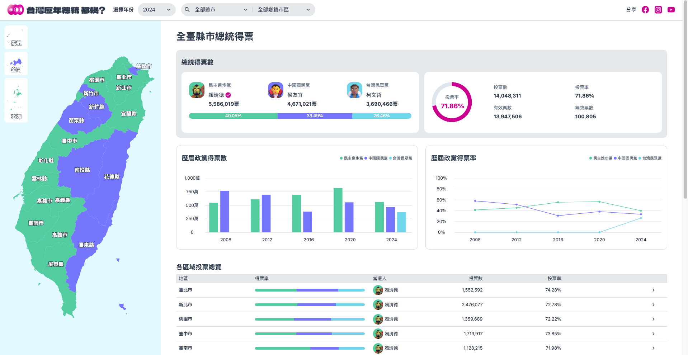

# The F2E 2023 - Mission 2 總統即時開票全台地圖



DEMO：https://feeng10914017.github.io/f2e-2024-mission2/portal

F2E 2023 官網：https://2023.thef2e.com/

## UI 設計作品

The F2E 2023 - Mission 2 總統即時開票全台地圖

- 標題：台灣歷年總統 都幾？
- 作者：jhen
- 連結：https://2023.thef2e.com/users/12061579704041679194?week=2

## 系統說明

專案安裝

```
npm i
```

專案啟動

```
npm start
```

專案打包

```
npm run build
```

## 使用技術

- npm (v22.11.0)
- Angular (v 19.0.2)
  - Stanealone
  - Material cdk
  - Reactive Form
- CSS
  - TailwindCSS (v3.4.15)
  - RWD
- 其他
  - D3.js
  - TopoJSON

## 資料夾說明

```
├── public
|  ├── favicon_io
|  ├── images
|  |  ├── 3d-president
|  |  └── icons
|  ├── map-topo-json                  // 台灣地圖資料
|  └── presidential-election-json     // 總統選舉資料
|     ├── 2008
|     ├── 2012
|     ├── 2016
|     ├── 2020
|     └── 2024
└── src
   └── app
      ├── core
      |  ├── constants
      |  ├── enums
      |  ├── guards
      |  ├── interceptors
      |  ├── interfaces
      |  ├── models
      |  ├── services
      |  └── types
      ├── shared                      // 共用渲染元件
      |  ├── components               // 基礎功能元件
      |  ├── dialogs                  // 彈窗元件
      |  ├── features                 // 頁面功能元件
      |  └── layouts                  // 佈局元件
      └── views                       // 路由頁面
```
